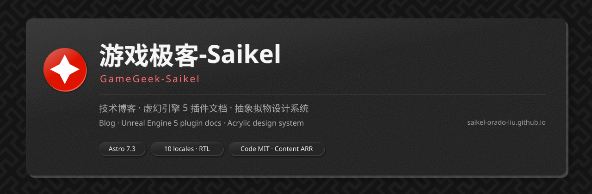

<p align="center">
  
</p>

<h1 align="center">游戏极客-Saikel · 个人网站</h1>

<p align="center">
  
</p>

<p align="center">
  <a href="./README.md">English</a>
  &nbsp;·&nbsp;
  <strong>简体中文</strong>
</p>

**Saikel-Orado-Liu（@游戏极客-Saikel）的个人网站** —— 一个纯静态、多语言（10 种 locale，含 RTL 阿拉伯语）的 Astro 站点，承载技术博客、虚幻引擎 5 插件文档，以及一套自建设计系统与其本地评审页。

没有服务端、没有运行时数据库、没有前端框架：所有页面在构建期由 Markdown/MDX 内容集合生成，同时产出十种语言的 Pagefind 索引，推送到 `main` 即由 GitHub Actions 部署到 GitHub Pages。

> **许可一览** —— 代码与样式为 **MIT**（[`LICENSE`](./LICENSE)）；文章、文档、图片与品牌资产为 **保留所有权利**（[`LICENSE-CONTENT`](./LICENSE-CONTENT)）；第三方资产遵循各自条款（[`THIRD-PARTY.md`](./THIRD-PARTY.md)）。详见[许可证](#许可证)。

## 目录

- [能力概览](#能力概览)
- [技术栈](#技术栈)
- [快速开始](#快速开始)
- [仓库结构](#仓库结构)
- [内容撰写](#内容撰写)
- [设计系统](#设计系统)
- [本地规范参考页](#本地规范参考页)
- [部署](#部署)
- [隐私与运行时](#隐私与运行时)
- [参与贡献](#参与贡献)
- [许可证](#许可证)
- [致谢](#致谢)
- [链接](#链接)

## 能力概览

| 方面 | 说明 |
| --- | --- |
| **多语言** | 十种 locale：`zh-cn`（默认）、`en-us`、`ja-jp`、`ko-kr`、`ar-sa`（RTL）、`es-es`、`fr-fr`、`pt-pt`、`ru-ru`、`de-de`。默认语言无前缀，其余经 `[locale]` 动态路由生成；缺失翻译回退 `zh-cn` |
| **内容集合** | 博客文章 + 按项目组织的完整文档树（章节 → 页面 → 翻译），构建期生成文档注册表，驱动侧边栏、前后篇导航与每页目录，无需手工维护索引 |
| **搜索** | 同一构建管线内生成 Pagefind 索引，十种语言归入同一多语言索引 |
| **设计系统** | Material Design 3 色彩角色 + 「抽象拟物」材质语言：三层阴影表达物理厚度、SVG 分形噪点颗粒、160° 漫反射高光、凹槽滑动导航 |
| **规范参考页** | `/spec/`（设计令牌）与 `/spec/components/`（全部控件与状态）是自包含的独立实现，与主站**不共享**任何 CSS 或组件；且**仅本地可用**（见[本地规范参考页](#本地规范参考页)） |
| **图片** | 自定义 Astro 图片服务经 sharp 输出 AVIF；图片点击放大；配图叠加纸张噪点 |
| **SEO / 订阅** | 各语言独立 RSS、带 `hreflang` 交替链接的 sitemap、Open Graph / Twitter 卡片、JSON-LD，部署后向 IndexNow 提交变更 URL |
| **无障碍** | 以 WCAG 2.2 AA 为目标：对比度核定色板、`:focus-visible` 焦点环令牌、完整键盘路径、≥24px 触控目标，主站全站 `prefers-reduced-motion` 降级 |

## 技术栈

| 层 | 选型 |
| --- | --- |
| 站点框架 | [Astro](https://astro.build) 7.3 —— `output: 'static'`，目录式构建产物 |
| 样式 | Tailwind CSS 4.3（经 `@tailwindcss/vite`）+ 手写 CSS 实现亚克力材质（`src/styles/`） |
| 语言 | TypeScript 5.9 —— 每次构建前执行 `astro check` |
| 内容 | Markdown + MDX（`@astrojs/mdx` 8）、GitHub 风格提示块（`remark-github-blockquote-alert`）、外链 rehype 插件 |
| 代码高亮 | Shiki 双主题（`github-dark` + 自定义亮色主题），经 CSS 变量切换 |
| 搜索 | [Pagefind](https://pagefind.app) 1.5 |
| 图片 | `sharp`，经自定义 AVIF 图片服务 |
| 订阅与 SEO | `@astrojs/rss`、`@astrojs/sitemap` |
| 持续集成 | GitHub Actions → GitHub Pages：`pnpm install --frozen-lockfile`、Node 26.3.0、产物守卫、IndexNow、Pagefind |

## 快速开始

要求：**Node ≥ 22.19**（CI 使用 26.3.0）、**pnpm 11**。

```bash
pnpm install
pnpm dev        # http://127.0.0.1:4321 —— 同时提供仅本地的 /spec/ 规范参考页
pnpm build      # astro check → astro build → 公开产物守卫 → Pagefind 索引
pnpm preview    # 预览构建产物
```

`pnpm build` 是交付门槛：先全项目类型检查、再静态生成，随后执行 `scripts/verify-public-output.mjs` —— 一旦内部页面（如 `/spec/`）或 `__` 前缀临时页混入 `dist/`，**直接让构建失败**。未通过即视为未完成。

## 仓库结构

```
src/
  components/   UI：layout（页头、页脚、搜索）、home、blog、doc、pages 与 route 组件
  content/      内容集合 —— blog/（每语言一文件）与 projects/（文档树）
  i18n/         十种语言的界面字典与 locale 工具
  layouts/      BaseLayout（主站）与 SpecLayout（独立规范参考页）
  pages/        路由：默认语言在根目录，其余在 [locale]/ 下
  scripts/      客户端脚本：主题、导航/目录滑块、希尔伯特与 Gosper 曲线、图片放大
  styles/       tokens · base · components · ui-spec · doc-shared · specbook
  utils/        内容与文档注册表工具
docs/           设计与工程规范文档
scripts/        构建期辅助：IndexNow 提交、公开产物守卫、README 资产生成（封面 + 徽章）
public/         静态资源（favicon、robots.txt）
LICENSES/       REUSE.toml 引用的许可证文本（MIT + 内容条款）
REUSE.toml      机器可读的按路径许可声明（REUSE 规范 3.3）
```

## 内容撰写

- **博客** —— `src/content/blog/*.md`；默认语言无后缀，翻译加 `.{locale}.md`。
- **项目文档** —— `src/content/projects/{slug}/`，含 `{NN}.{chapter-slug}/` 章节目录与 `{NN}.{doc-slug}[.{locale}].md`。自定义 content loader 在构建期生成文档注册表（顺序、章节、标题、翻译），侧边栏与前后篇导航自动生成，无需手工维护。
- **界面文案** —— `src/i18n/{locale}.json`；缺失键回退 `zh-cn`。

## 设计系统

视觉语言与其数值定义在 `docs/`，实现落在 `src/styles/`：

| 文档 | 内容 |
| --- | --- |
| `docs/网页设计规范.md` | 设计总纲：哲学、十色体系、字体、形状、三层阴影/厚度体系、材质管线 |
| `docs/组件设计规范.md` | 逐组件规格：结构、尺寸、状态机、明暗对照、动效、实现文件 |
| `docs/响应式设计规范.md` | 断点体系、导航折叠、文档栅格、溢出治理、RTL、截图矩阵 |
| `docs/动效设计规范.md` | 动效令牌、缓动语义、组件动效矩阵、视图过渡、减动效策略 |
| `docs/无障碍设计规范.md` | WCAG 2.2 AA 目标、实测对比度表、焦点/键盘/触控规则、验收清单 |
| `docs/版本控制规范.md` | 本仓库使用的提交信息约定 |

**实施铁律**：样式与行为变更先在独立的 `/spec/` 参考页实现并评审，通过后再同步到主站。参考页与主站不共享任何 CSS 或组件文件——只共享数值标准。

## 本地规范参考页

规范参考页是设计系统的评审界面，**有意不进入公开站点**：

- 页面实体位于 `src/spec/` —— 不在 `src/pages/` 下，因此 Astro 默认不为它们生成路由。
- `specLocalOnly()` 集成**只在 `command === 'dev'` 时注入路由**，生产构建永远不会产出 `/spec/`。
- `scripts/verify-public-output.mjs` 作为纵深防御：产物中一旦出现内部页面即让构建失败（与 `noindex`、sitemap 过滤共同兜底）。

```bash
pnpm dev   # 然后打开 http://127.0.0.1:4321/spec/ 与 /spec/components/
```

## 部署

推送到 `main` 触发 `.github/workflows/deploy.yml`：安装依赖 → 构建（`astro check`、`astro build`、公开产物守卫、Pagefind）→ 向 IndexNow 提交变更 URL → 上传 `dist` → 部署 GitHub Pages。浏览器所需的一切都已预构建；运行时唯一的外部请求来自两个字体 CDN。

## 隐私与运行时

本站**没有统计脚本、没有跟踪代码、没有 Cookie、没有第三方嵌入**。页面是静态 HTML/CSS，仅用少量原生 JavaScript 实现主题切换、滑块与图片放大；字体文件是唯一从第三方源拉取的资源。未来若引入任何会改变这一点的东西，必须先在此处写明。

## 参与贡献

这是个人网站，不是社区项目：

- **欢迎提 Issue** —— 尤其是错别字、失效链接、翻译纠正与无障碍问题。
- **Pull Request**：请先开 Issue 并等待回复，确认方案后再投入修改。
- **内容复用**受下方[许可证](#许可证)约束——代码为 MIT，文章与文档不是。

## 许可证

本仓库采用**多许可证混合**，复用前请先确认范围：

| 部分 | 许可证 | 涉及文件 |
| --- | --- | --- |
| **源代码、构建配置、设计系统实现** —— 组件、布局、脚本、样式与设计令牌、工具、界面文案字典、CI 配置 | **MIT** —— 见 [`LICENSE`](./LICENSE) | `src/**`（`src/content/**` 除外）、`scripts/**`、各配置文件 |
| **文本与内容** —— 博客文章、项目文档及其翻译与配图、设计规范文档 —— 以及**品牌资产**（游戏极客-Saikel / GameGeek-Saikel 名称、Logo、头像、社交图片） | **保留所有权利** —— 见 [`LICENSE-CONTENT`](./LICENSE-CONTENT) | `src/content/**`、`docs/**`、品牌资产 |
| **第三方资产** —— 字体、图标、依赖库 | 各自许可证 —— 见 [`THIRD-PARTY.md`](./THIRD-PARTY.md) | 见该文件说明 |

这套划分同时是**机器可读**的：[`REUSE.toml`](./REUSE.toml) 声明各路径适用哪个许可证，[`LICENSES/`](./LICENSES) 存放许可证文本，符合 [REUSE 规范 3.3](https://reuse.software/spec/)，可用 linter 校验：

```bash
uvx --from "reuse[charset-normalizer]" reuse lint   # → compliant：267/267 文件均已覆盖
```

简而言之（白话说明，法律效力以 [`LICENSE`](./LICENSE) 与 [`LICENSE-CONTENT`](./LICENSE-CONTENT) 的英文正文为准）：

- **代码与样式（MIT）**：可自由使用、修改、分发，保留版权声明即可。
- **内容（保留所有权利）**：欢迎阅读、链接与**少量引用**，但必须注明作者 *Saikel-Orado-Liu（游戏极客-Saikel）* 并附原文链接。整篇转载、镜像、翻译后发表、商业使用，或纳入 AI/ML 训练语料，均需**事先获得书面许可**（申请渠道见 `LICENSE-CONTENT`）。

```text
代码与样式 : MIT © 2026 Saikel-Orado-Liu aka GameGeek-Saikel
内容       : 保留所有权利 © 2026 Saikel-Orado-Liu aka GameGeek-Saikel
```

## 致谢

本站渲染或打包的字体、图标与依赖库归各自作者所有，均按其自身许可证使用——完整清单（含链接）见 [`THIRD-PARTY.md`](./THIRD-PARTY.md)。其中主要有 **MiSans**（© 小米，经小米官方 CDN 加载）、**JetBrains Mono**（SIL OFL 1.1）、**Boxicons**（MIT）、**Astro**、**Tailwind CSS**、**Pagefind**、**Shiki**（均 MIT）与 **sharp**（Apache-2.0）。X、抖音、Bilibili 的品牌标识为内联 SVG，商标归各自所有者，仅用于身份识别。

## 链接

- 网站 —— <https://saikel-orado-liu.github.io>
- GitHub —— <https://github.com/Saikel-Orado-Liu>
- X（Twitter）—— <https://x.com/GameGeek_Saikel>
- Texturge（UE5 文本动画插件）—— <https://saikel-orado-liu.github.io/projects/texturge/>
